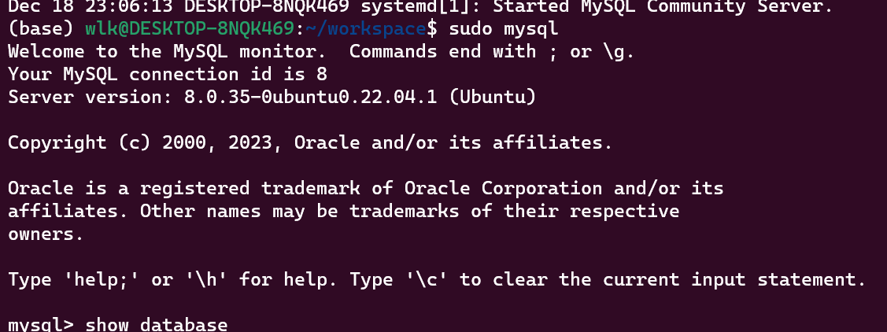
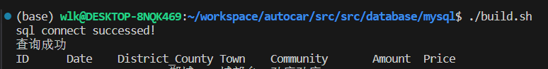

# autocar
本项目主要用于自动驾驶软件的开发，主要针对机器人中的自动驾驶
0）CMake和bazel的编译工具链的制作
1）自动驾驶中间件开发，ROS2,DDS,和SQL数据库
2）QT界面的开发：利用的算法可利用现成的YOLO测试
3）OpenGL，CUDA,OpenCV,Pytorch的学习和利用
4）自动驾驶环境感知算法包括：目标检测和SLAM（ROS2集成开发）

mysql登录：
启动终端：sudo mysql 确认即可

Mysql查询

# C++开发：如何设计项目结构:
设计一个C++项目的结构时，需要考虑多个方面，包括代码组织、模块化、可维护性、可扩展性和编译管理。以下是一个逐步设计C++项目结构的指南：
## 步骤1：确定项目需求和模块
首先，明确项目的需求和功能模块。将项目分解为若干个独立的模块，每个模块负责特定的功能。这有助于代码的组织和管理。

## 步骤2：创建项目目录结构
一个良好的目录结构能帮助你更好地组织代码和资源。以下是一个典型的C++项目目录结构示例：
MyProject/
├── CMakeLists.txt       # CMake配置文件
├── include/             # 头文件目录
│   ├── module1/         # 模块1的头文件
│   └── module2/         # 模块2的头文件
├── src/                 # 源文件目录
│   ├── main.cpp         # 主程序入口
│   ├── module1/         # 模块1的源文件
│   └── module2/         # 模块2的源文件
├── tests/               # 测试代码目录
│   ├── test_module1.cpp # 模块1的测试代码
│   └── test_module2.cpp # 模块2的测试代码
├── docs/                # 文档目录
└── build/               # 编译输出目录（通常不放入版本控制）

## 步骤3：设置构建系统
选择一个构建系统来管理编译过程。CMake是一个常用的跨平台构建系统。下面是一个简单的CMakeLists.txt示例：
cmake_minimum_required(VERSION 3.10)
project(MyProject)

### 设置C++标准
set(CMAKE_CXX_STANDARD 17)

set(CMAKE_CXX_STANDARD_REQUIRED True)

### 包含头文件目录
include_directories(include)

### 查找所有源文件
file(GLOB_RECURSE SOURCES "src/*.cpp")

### 添加可执行文件
add_executable(MyProject ${SOURCES})

### 添加测试
enable_testing()
add_subdirectory(tests)

## 步骤4：编写模块代码

### 根据项目需求，在include和src目录下分别创建头文件和源文件。例如：
include/module1/Module1.h
#ifndef MODULE1_H
#define MODULE1_H

namespace Module1 {
    void function1();
}

#endif // MODULE1_H

### src/module1/Module1.cpp
#include "module1/Module1.h"
#include <iostream>

namespace Module1 {
    void function1() {
        std::cout << "Hello from Module1!" << std::endl;
    }
}

## 步骤5：编写主程序
在src/main.cpp中编写主程序入口：

#include "module1/Module1.h"

int main() {
    Module1::function1();
    return 0;
}

## 步骤6：编写测试代码
在tests目录下编写测试代码，并在CMakeLists.txt中添加测试配置。例如，可以使用Google Test框架进行单元测试。

## tests/CMakeLists.txt
add_executable(test_module1 test_module1.cpp)
target_link_libraries(test_module1 gtest gtest_main)
add_test(NAME test_module1 COMMAND test_module1)

## tests/test_module1.cpp

#include <gtest/gtest.h>
#include "module1/Module1.h"

TEST(Module1Test, Function1) {
    // 测试代码
    Module1::function1();
    ASSERT_TRUE(true); // 示例断言
}

int main(int argc, char **argv) {
    ::testing::InitGoogleTest(&argc, argv);
    return RUN_ALL_TESTS();
}
## 步骤7：编译和运行
在项目根目录下创建build目录并编译项目：

mkdir build
cd build
cmake ..
make
执行编译后的可执行文件和测试：

./MyProject
ctest
通过以上步骤，你可以创建一个结构清晰、模块化的C++项目，并使用CMake进行编译管理和测试。根据项目的复杂性和需求，可以进一步扩展和优化项目结构。