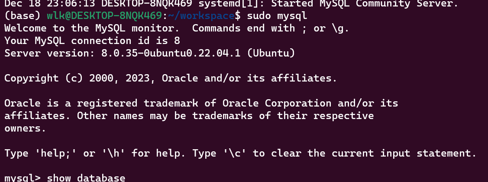

# autocar
本项目主要用于自动驾驶软件的开发，主要针对机器人中的自动驾驶
0）CMake和bazel的编译工具链的制作
1）自动驾驶中间件开发，ROS2,DDS,和SQL数据库
2）QT界面的开发：利用的算法可利用现成的YOLO测试
3）OpenGL，CUDA,OpenCV,Pytorch的学习和利用
4）自动驾驶环境感知算法包括：目标检测和SLAM（ROS2集成开发）

mysql登录：
启动终端：sudo mysql 确认即可
